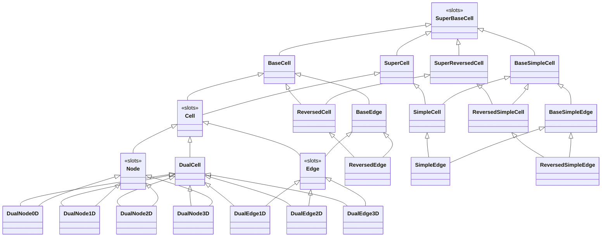
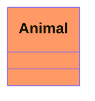

# About

pyCellFoam is a python library that implements the Cell Method  to simulate heat transfer on open cell foams. It was brought to life by the Munich node of the [INFIDHEM project](https://www.mw.tum.de/rt/emc/interconnected-systems-infidhem/) at the TUM Chair of Automatic Control in cooperation with LAGEPP at Université Claude Bernard Lyon 1. An example geometry that can be used in the cell method is shown in Fig. 1.

*Fig. 1: Cell complex based on a Kelvin Cell*

# Installation

## Python

This library is based on Python 3.8.

An installation of the python distribution [Anaconda](https://anaconda.org/) is recommended.

## Python packages

Hint: open anaconda prompt  with admin privileges.

* tabulate: `conda install -c conda-forge tabulate`
* sphinx: `conda install -c anaconda sphinx`
* fulltoc: `conda install -c conda-forge sphinxcontrib-fulltoc`
* automodule: `conda install -c conda-forge sphinx-autodoc-typehints`
* ffmpeg : `conda install -c conda-forge ffmpeg`
* (vtk?)

## Sphinx and library environment variable

Sphinx and this library need to be added to the environment variables:

1. Open environment variables
2. Open variable `Path` (If it does not exist yet, create it)
3. Add the folder where sphinx has been installed, it should be something like `C:\ProgramData\Anaconda3\Scripts`
4. Add the variable `PYTHONPATH`  to the environment variables. Set its value to the location where you cloned this repository.
5. Restart your computer so that the environment variables get updated.

# Tutorial

# Related Publications

# UML

